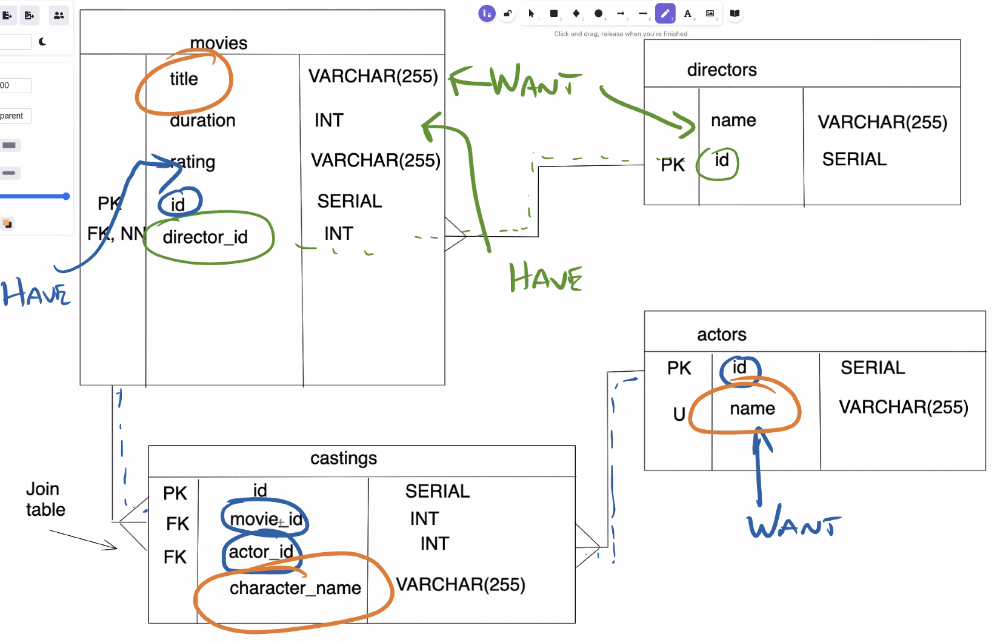

# Practice Task - Movies database

## Set up



```sql
--SELECT * FROM movies;

--DROP TABLE movies;


-- Create Directors table first
CREATE TABLE directors(
	id SERIAL PRIMARY KEY,
	name VARCHAR(255)
);

-- Create movies table
CREATE TABLE movies (
	id SERIAL PRIMARY KEY,
	title VARCHAR(255),
	duration INT,
	rating VARCHAR(255),
	director_id INT REFERENCES directors(id) NOT NULL
);

-- Insert initial data into tables (directors and movies)
INSERT INTO directors (name) VALUES ('Ridley Scott');
INSERT INTO directors (name) VALUES ('Morten Tyldum');
INSERT INTO directors (name) VALUES ('Jon Favreau');
INSERT INTO directors (name) VALUES ('Steven Spielberg');

INSERT INTO movies (title, duration, rating, director_id) VALUES ('Alien', 117, '18', 1);
INSERT INTO movies (title, duration, rating, director_id) VALUES ('The Imitation Game', 114, '12A', 2);
INSERT INTO movies (title, duration, rating, director_id) VALUES ('Iron Man', 126, '12A', 3);
INSERT INTO movies (title, duration, rating, director_id) VALUES ('The Martian', 144, '12A', 1);

-- Add another director and another movie
INSERT INTO directors (name) VALUES ('Anthony Russo');

INSERT INTO movies (title, duration, rating, director_id) VALUES ('Avengers: Endgame', 181, '12A', 4);


-- Create actors table
CREATE TABLE actors (
	id SERIAL PRIMARY KEY,
	name VARCHAR(255)
);

-- Insert actors data into actors table
INSERT INTO actors (name) VALUES ('Sigourney Weaver');
INSERT INTO actors (name) VALUES ('Benedict Cumberbatch');
INSERT INTO actors (name) VALUES ('Robert Downey Jr');
INSERT INTO actors (name) VALUES ('Gwyneth Paltrow');
INSERT INTO actors (name) VALUES ('John Boyega');

-- Create castings table (the joining table, could also be called movies_actors table)
CREATE TABLE castings (
	id SERIAL PRIMARY KEY,
	movie_id INT REFERENCES movies(id),
	actor_id INT REFERENCES actors(id),
	character_name VARCHAR(255)
);

-- Insert castings data into castings table
INSERT INTO castings (movie_id, actor_id, character_name) VALUES (1, 1, 'Ripley');
INSERT INTO castings (movie_id, actor_id, character_name) VALUES (2, 2, 'Alan Turing');
INSERT INTO castings (movie_id, actor_id, character_name) VALUES (3, 3, 'Tony Stark');
INSERT INTO castings (movie_id, actor_id, character_name) VALUES (3, 4, 'Pepper Potts');
INSERT INTO castings (movie_id, actor_id, character_name) VALUES (5, 2, 'Dr Strange');
INSERT INTO castings (movie_id, actor_id, character_name) VALUES (5, 3, 'Tony Stark');
INSERT INTO castings (movie_id, actor_id, character_name) VALUES (5, 4, 'Pepper Potts');

-- UPDATE
UPDATE MOVIES SET director_id = 5 WHERE id = 5;
```


## Writing queries

```sql

-- LEFT JOIN
-- (Syntax:  table_1.column_name = table_2.column_name)
SELECT * FROM directors
LEFT JOIN movies
ON directors.id = movies.director_id;

-- INNER JOIN
SELECT * FROM directors
INNER JOIN movies
ON directors.id = movies.director_id;

--UPDATE MOVIES SET director_id = 5 WHERE id = 5;

--
SELECT directors.name, movies.title FROM directors
LEFT JOIN movies
ON directors.id = movies.director_id
WHERE movies.duration < 120;

--
SELECT * FROM directors
LEFT JOIN movies
ON directors.id = movies.director_id;
WHERE movies.id IS NULL;

-- Joining across multiple tables
SELECT * FROM actors
INNER JOIN castings
ON actors.id = castings.actor_id;

-- LEFT JOIN shows all actors, even those with NULLS
SELECT * FROM actors
LEFT JOIN castings
ON actors.id = castings.actor_id;

-- Actors who have been in an 18-rated movie
--SELECT * FROM actors
--INNER JOIN castings
--ON actors.id = castings.actor_id
--INNER JOIN movies
--ON castings.movie_id = movies.id;

--SELECT * FROM actors
--INNER JOIN castings
--ON actors.id = castings.actor_id
--INNER JOIN movies
--ON castings.movie_id = movies.id
--WHERE movies.rating = '18';

SELECT actors.name, castings.character_name, movies.title FROM (actors
	INNER JOIN castings
	ON actors.id = castings.actor_id)
INNER JOIN movies
ON castings.movie_id = movies.id
WHERE movies.rating = '18';
```
