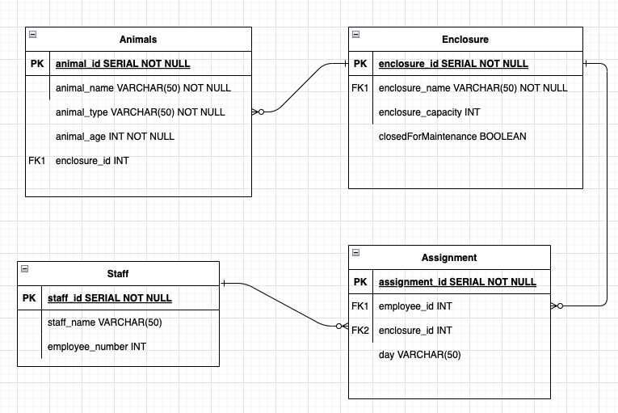

# Task - Safari Park

## The Data

Our users will be able to enter details for the animals in the park, their enclosures and the staff working there. Each member of staff will be assigned to a different enclosure on a different day; each enclosure will have more than one person looking after it. The data entered by the user will look like this:

```json
// animal

{
	"id": 1,
	"name": "Tony",
	"type": "Tiger",
	"age": 59,
	"enclosure_id": 1
}

// enclosure

{
	"id": 1,
	"name": "big cat field",
	"capacity": 20,
	"closedForMaintenance": false
}

// staff

{
	"id": 1,
	"name": "Captain Rik",
	"employeeNumber": 12345,
}

// assignment

{
	"id": 1,
	"employeeId": 1,
	"enclosureId": 1,
	"day": "Tuesday"
}
```

## Task

- Draw an entity relationship diagram to show the structure of the tables and the relationships between them. Each table should have enough columns to capture all the data shown in the JSON above.



- Set up the tables in a postgres database.

```sql

-- ******************************* --
--      CLEAR EXISTING TABLE(S)    --
-- ******************************* --

DROP TABLE IF EXISTS staff CASCADE;
DROP TABLE IF EXISTS enclosure CASCADE;
DROP TABLE IF EXISTS assignment CASCADE;
DROP TABLE IF EXISTS animal CASCADE;


-- ******************************* --
--           CREATE TABLES     	   --
-- ******************************* --

CREATE TABLE staff (
staff_id SERIAL PRIMARY KEY,
name VARCHAR(255),
employee_number INT
);

CREATE TABLE enclosure (
enclosure_id SERIAL PRIMARY KEY,
enclosure_name VARCHAR(255),
capacity INT,
closedForMaintenance BOOLEAN
);

CREATE TABLE assignment (
assignment_id SERIAL PRIMARY KEY,
staff_id INT REFERENCES staff(staff_id),
enclosure_id INT REFERENCES enclosure(enclosure_id),
assignment_day VARCHAR(255)
);

CREATE TABLE animal (
animal_id SERIAL PRIMARY KEY,
name VARCHAR(255),
type VARCHAR(255) NOT NULL,
age INT,
enclosure_id INT REFERENCES enclosure(enclosure_id)
);

```

- Populate the tables with some of your own data. (Don't worry about the capacity restriction on enclosures for now, checking the would be handled by the back-end before the data gets sent to the database.)

```sql

-- ******************************* --
--            INSERT DATA          --
-- ******************************* --

-- Staff table data
INSERT INTO staff(name, employee_number) VALUES
	('Michael', 001),
	('Abdi', 002),
	('Rachel', 003), 
	('Hajr', 004),
	('Suad', 005),
	('Michelle', 006);

-- Enclosure table data
INSERT INTO enclosure(enclosure_name, capacity, closedForMaintenance) VALUES
	('The Big Cat Park', 15, FALSE),
	('The Lions Den', 7, FALSE),
	('Hungry Hippos', 4, TRUE),
	('The Loud Trees', 18, FALSE);
	
-- Animals table data
INSERT INTO animal(name, type, age, enclosure_id) VALUES 
	('Griff','Tiger', 35, 1),
	('Tony','Tiger', 34, 1),
	('Caroline','Lion', 25, 2),
	('Arnold','Lion', 30, 2),
	('Elena','Hippo', 41, 3),
	('Smithy','Gorilla', 41, 4),
	('Sarah','Gorilla', 28, 4),
	('Baby', 'Gorilla', 1, 4);

-- Assignments table data
INSERT INTO assignment (staff_id, enclosure_id, assignment_day) VALUES
	(001, 1, 'Monday'),
	(001, 1, 'Tuesday'),
	(001, 1, 'Wednesday'),
	(002, 1, 'Thursday'),
	(002, 1, 'Friday'),
	(003, 1, 'Saturday'),
	(003, 1, 'Sunday'),

	(002, 2, 'Monday'),
	(002, 2, 'Tuesday'),
	(002, 2, 'Wednesday'),
	(001, 2, 'Thursday'),
	(001, 2, 'Friday'),
	(001, 2, 'Saturday'),
	(004, 2, 'Sunday'),
	
	(004, 3, 'Monday'),
	(004, 3, 'Tuesday'),
	(004, 3, 'Wednesday'),
	(004, 3, 'Thursday'),
	(005, 3, 'Friday'),
	(005, 3, 'Saturday'),
	(005, 3, 'Sunday'),

	(005, 4, 'Monday'),
	(005, 4, 'Tuesday'),
	(006, 4, 'Wednesday'),
	(006, 4, 'Thursday'),
	(006, 4, 'Friday'),
	(006, 4, 'Saturday'),
	(006, 4, 'Sunday');
	
```


- Write queries to find:

1. The names of the animals in a given enclosure

```sql

-- Select animal name(s) from the animal table
SELECT animal.name 
FROM animal
-- join with the enclosure table, where PK matches the FK (enclosure IDs) in the animals table
INNER JOIN enclosure
ON enclosure.enclosure_id = animal.enclosure_id
-- and where either the enclosure is ID = 1 or name = 'The Loud Trees';
WHERE enclosure.enclosure_id = 1 OR enclosure.enclosure_name = 'The Loud Trees';

-- This works the same as the above, but instead returns 3 named columns - Enclosure ID and name, and the animal
SELECT enclosure.enclosure_id as "Enclosure ID", enclosure.enclosure_name as "Enclosure", animal.name as "Animal" 
FROM animal
INNER JOIN enclosure
ON animal.enclosure_id = enclosure.enclosure_id
WHERE enclosure.enclosure_id = 1 OR enclosure.enclosure_name = 'The Loud Trees';

```

2. The names of the staff working in a given enclosure

```sql

-- Select staff names from the staff table
SELECT DISTINCT staff.name 
FROM staff
-- and join with the assignment table, where staff ID matches the staff ID in the staff table 
INNER JOIN assignment
ON assignment.staff_id = staff.staff_id
WHERE assignment.enclosure_id = 1;

```

## Extensions

- Don't be tempted to perform too many joins, think about the data stored in each table.
- Remember that the result of a join is just another table. It can be filtered, ordered, summarised and joined again as much as you need.

Write queries to find:

3. The names of staff working in enclosures which are closed for maintenance

```sql

SELECT DISTINCT staff.name 
FROM staff
INNER JOIN assignment
ON assignment.staff_id = staff.staff_id
INNER JOIN enclosure
ON enclosure.enclosure_id = assignment.enclosure_id
WHERE enclosure.closedformaintenance IS TRUE;


```

4. Find the name of the enclosure where the oldest animal lives

```sql

If there are two animals who are the same age choose the first one alphabetically. */
SELECT enclosure.enclosure_name as "Enclosure", animal.name as "Animal"
FROM animal
INNER JOIN enclosure
ON animal.enclosure_id = enclosure.enclosure_id
WHERE animal.age = (SELECT MAX(animal.age) FROM animal)
ORDER BY animal.name ASC LIMIT 1;

```

5. The number of different animal types a given keeper has been assigned to work with

```sql

SELECT COUNT(DISTINCT animal.type)
FROM animal
INNER JOIN enclosure
ON animal.enclosure_id = enclosure.enclosure_id
INNER JOIN assignment
ON assignment.enclosure_id = enclosure.enclosure_id
WHERE assignment.staff_id = 3;

```

6. The number of different keepers who have been assigned to work in a given enclosure

```sql

SELECT COUNT(DISTINCT staff.name)
FROM staff
INNER JOIN assignment
ON assignment.staff_id = staff.staff_id
WHERE assignment.enclosure_id = 4;

```

7. The names of the other animals sharing an enclosure with a given animal (eg. find the names of all the animals sharing the big cat field with Tony)

```sql

SELECT animal.name FROM animal
INNER JOIN enclosure ON enclosure.enclosure_id = animal.enclosure_id
WHERE enclosure.enclosure_id = 
	(SELECT animal.enclosure_id 
	FROM animal 
	WHERE animal.name = 'Tony')
AND animal.name = 'Tony' IS FALSE;

```